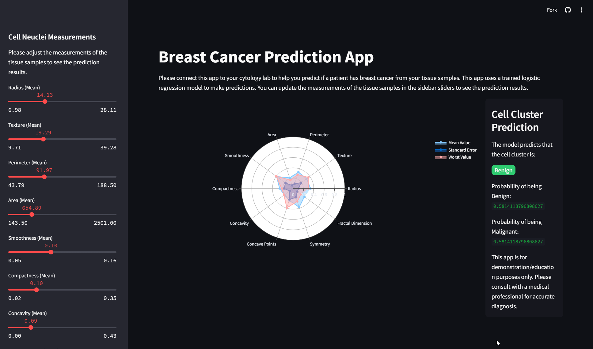

# Breast Cancer Prediction App

Developed a logistic regression model using SciKit-learn to predict whether a cell is benign or malignant. Designed and deployed a custom interface with Streamlit to visualize the predictions, and published the application for broader accessibility.

[Try it out on Streamlit here!](https://breast-cancer-prediction-app-garrison.streamlit.app)

## Data Cleaning

First, I started by cleaning the data from the cancer_data CSV. This included dropping columns, changing diagnosis values from alphabetical to binary, and dropping duplicate rows.

```python
def get_clean_data():
    # Load data
    data = pd.read_csv(r'data/cancer_data.csv')
    # Drop columns
    data = data.drop(['Unnamed: 32', 'id'], axis=1)
    # Map diagnosis to binary
    data['diagnosis'] = data['diagnosis'].map({ 'M': 1, 'B': 0 })
    # Drop duplicates
    data = data.drop_duplicates()
    # Reset index
    data = data.reset_index(drop=True)
    
    return data
```

## Model Training

Next, we move into creating the model and training it.

For this model, we are using the Logistic Regression model from SciKit Learn. We start by splitting the data into training groups and test groups using an 80%/20% split. Then, we have to scale the data so that all values hold the same weight with respect to the model's algorithm. Finally, we can train the model, predict on it, and print out an accuracy report.

```python
def create_model(data):

    # Split data into X and y
    X = data.drop('diagnosis', axis=1)
    y = data['diagnosis']
    
    # Split data into training and testing sets
    X_train, X_test, y_train, y_test = train_test_split(X, y, test_size=0.2, random_state=42)
    
    # Scale data
    scaler = StandardScaler()
    X = scaler.fit_transform(X)
    
    # Train model and fit it
    model = LogisticRegression()
    model.fit(X_train, y_train)
    
    # Test model
    y_pred = model.predict(X_test)
    
    # Print results
    print('Accuracy: ', accuracy_score(y_test, y_pred))
    print('Classification Report: \n', classification_report(y_test, y_pred))
    
    return model, scaler
```

## Exporting the Model

Lastly, we need to export the model in a .pkl format to load into the Streamlit application.

We do this by importing pickle, then using the dump function to create a model.pkl file. Next, we need to also export the scaler functionality as a pickle file.

```python
def main():
    
    # Run functions
    data = get_clean_data()
    
    model, scaler = create_model(data)
    
    # Save model as a pickle file
    with open('model/model.pkl', 'wb') as model_file:
        pickle.dump(model, model_file)
        
    # Save scaler as a pickle file
    with open('model/scaler.pkl', 'wb') as scaler_file:
        pickle.dump(scaler, scaler_file)
```

## Creating the Streamlit App
You can find all of my source code for the streamlit app in the app_main.py file above.

## Photos of finished Streamlit App
